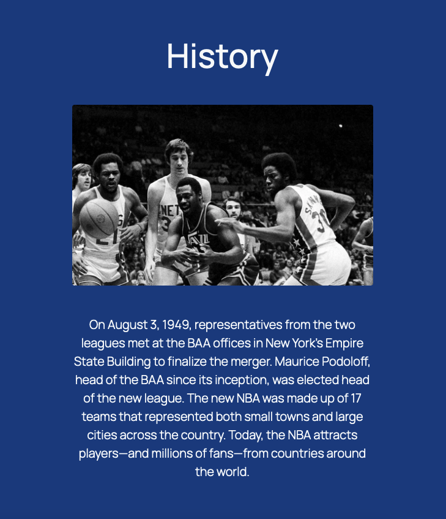
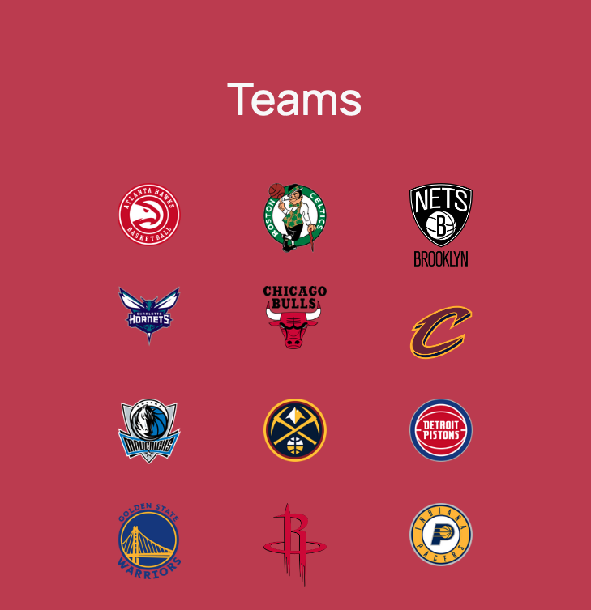

# Bootstrap-NBA-Site
An informational site about the NBA; created with Bootstrap along with minimal CSS stylings

 

# Screenshots

 

 

 

# Technologies Used & Features
**Implemented using:** 
* Bootstrap
* HTML
* CSS

 

**Features:** 
* Bootstrap grid (columns and rows) used thoroughly
* Site made responsive through Bootstrap classes
* Containers used throughout site
* Fluid images utilized for responsiveness
* Google fonts used for 'Manrope' font
* CDN was used to initialize Bootstrap
